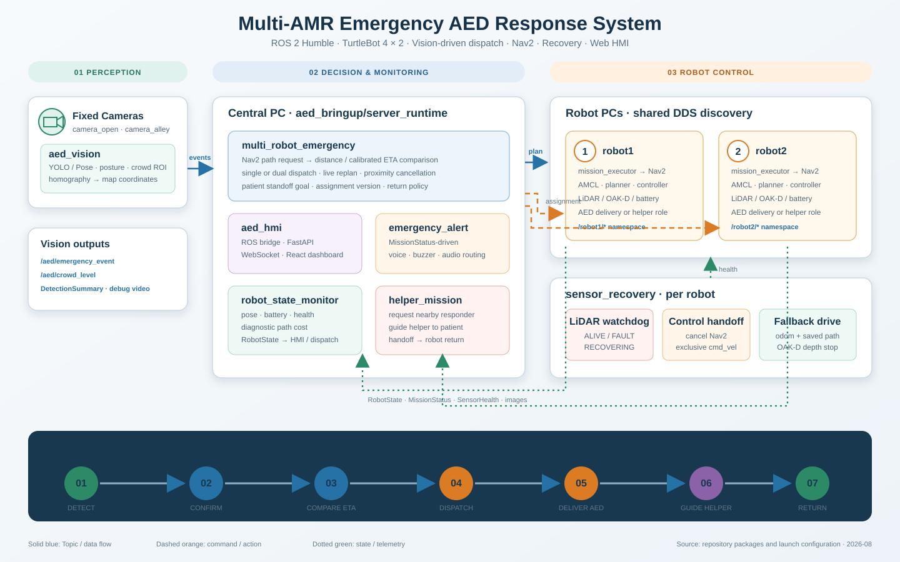

# Multi-AMR Emergency AED Response System

<p align="center">
  &nbsp;&nbsp;&nbsp;&nbsp;
</p>

두 대의 TurtleBot 4가 공용 지도에서 대기하다가 카메라가 응급 상황을 확정하면,
Nav2 경로와 ETA를 비교해 AED 로봇을 출동시키는 ROS 2 Humble 프로젝트입니다.
목표 시간 내 도착이 어렵다고 판단되면 두 대를 함께 출동시킬 수 있고, 주행 중
경로·LiDAR 장애나 로봇 간 근접 상황에는 취소, 복귀 또는 대체 주행을 수행합니다.
AED 도착 뒤에는 다른 로봇이 주변 구조 인력을 찾아 환자 위치로 안내할 수 있습니다.

> 실제 로봇을 움직이기 전에는 반드시 `dispatch_enabled:=false`로 전체 데이터
> 흐름을 확인하고, 로봇 가까이에서 비상 정지를 준비하세요.

## Key features

- 고정 카메라의 YOLO/Pose 낙상 판정과 호모그래피 기반 지도 좌표 생성
- 두 로봇의 실제 Nav2 경로와 보정 ETA를 비교하는 단일·동시 배차
- 환자 앞 안전 정지, 주행 중 재계획, 로봇 근접 시 목표 취소와 자동 복귀
- LiDAR 장애 감지와 Nav2 → odom/OAK-D depth fallback 제어권 인계
- AED 도착 후 별도 로봇의 구조 인력 호출, 현장 안내와 임무 복귀
- FastAPI/WebSocket/React 기반 실시간 지도·영상·상태 관제

## System architecture



중앙 PC는 판단과 관제를 담당하고, 각 로봇 PC는 동일한 DDS discovery 환경에서
Localization, Nav2와 센서 복구를 담당합니다. 파란 실선은 데이터 토픽, 주황
파선은 명령·Action, 녹색 점선은 상태·텔레메트리 흐름입니다.

## System flow

```text
고정 카메라(aed_vision)
  └─ EmergencyEvent / CrowdLevel / DetectionSummary
       └─ 중앙 배차(multi_robot_emergency)
            ├─ robot1·robot2 Nav2 경로 및 ETA 비교
            ├─ MissionAssignment → robot_missions → Nav2 주행
            ├─ LiDAR 장애 → sensor_recovery fallback 또는 재할당
            └─ AED 도착 → helper_mission → 구조 인력 호출·안내

RobotState / MissionStatus / 영상 → aed_hmi 웹 관제
MissionStatus → emergency_alert 음성·경보
```

기본 배차 정책은 최소 ETA 로봇 한 대를 선택합니다. 가장 빠른 ETA도 목표 시간의
설정 비율 이상이면 두 로봇을 동시에 보낼 수 있으며, 먼저 도착한 로봇이 생기거나
두 로봇이 너무 가까워지면 늦은 로봇의 목표를 취소하고 출발 위치로 복귀시킵니다.
환자 좌표는 기본적으로 환자 앞 `0.65 m` 안전 정지점으로 변환됩니다.

## Packages

| 패키지 | 역할 | 현재 상태 |
|---|---|---|
| `aed_interfaces` | 이벤트, 로봇·센서·미션 메시지와 AED 전달·조력자 Action | 인터페이스 구현 |
| `aed_vision` | 고정/로봇 카메라 입력, YOLO·Pose 판정, 혼잡도, 호모그래피 지도 좌표 | 구현·단위 테스트 |
| `multi_robot_emergency` | 두 Nav2 경로·ETA 비교, 단일/동시 배차, 재계획·복귀 | 구현·단위 테스트 |
| `robot_missions` | 배정 version 처리, Nav2 AED 전달, 상태·진행률 발행 | 구현·단위 테스트 |
| `robot_state_monitor` | 위치·배터리·Nav2 상태 및 진단용 경로비용 발행 | 구현·단위 테스트 |
| `turtlebot4_map_navigation` | 공용 지도 Localization, 초기 자세, Nav2·RViz 실행 | 구현·설정 테스트 |
| `sensor_recovery` | LiDAR watchdog, Nav2 제어권 인계, odom/depth fallback | 구현·fault-cycle 절차 제공 |
| `helper_mission` | 구조 인력 탐색, 호출음·음성 안내, 환자 위치 인계 | 구현·단위 테스트 |
| `emergency_alert` | MissionStatus 기반 로봇별 부저·음성 경보 | 구현·단위 테스트 |
| `aed_hmi` | ROS bridge, FastAPI/WebSocket, React 관제 화면과 이력 | 구현·단위 테스트 |
| `aed_bringup` | 중앙 런타임과 로봇 Nav2/fallback 통합 launch | 구현 |
| `amr_recovery` | Heartbeat·네트워크·Nav2 복구 관리자 | 실행 가능한 scaffold |
| `emergency_location_mapper` | 외부 신고/구역 좌표를 지도 좌표로 변환 | 실행 가능한 scaffold |
| `event_logger` | 이벤트와 미션 전이 영속 저장 | 실행 가능한 scaffold |

`src/mission_manager`는 ROS 패키지 manifest가 없는 과거 코드 디렉터리이며 현재
배차 진입점이 아닙니다. 운영 배차는 `multi_robot_emergency`를 사용합니다.

## Repository layout

```text
multi_amr_aed/
├── src/                 # 14개 ROS 2 패키지와 HMI frontend
├── maps/                # 공용 map.yaml 및 측정 지도
├── models/              # 배포 모델 위치
├── vision_training/     # 학습·평가·데이터 준비 도구
├── tools/               # 환경, preflight, 보정, 장애 주입 스크립트
├── docs/                # 인터페이스, 복구, 보정 및 검증 문서
├── config/              # 저장소 공용 설정 확장 위치
└── tests/               # 저장소 수준 통합 테스트 확장 위치
```

이 저장소 자체가 `src/`를 포함하는 colcon workspace입니다.
`~/rokey_ws/src/multi_amr_aed`처럼 다른 workspace의 `src` 아래에 중첩해 clone하지
마세요.

## Requirements and setup

- Ubuntu 22.04, ROS 2 Humble
- TurtleBot 4 ROS/Nav2 패키지와 Discovery Server 환경
- Python 3.10
- 비전: Ultralytics, OpenCV, NumPy
- HMI: FastAPI/Uvicorn 및 Node.js/npm

```bash
mkdir -p ~/rokey_ws
cd ~/rokey_ws
git clone https://github.com/Gongdol2Robot/multi_amr_aed.git
cd multi_amr_aed

source /opt/ros/humble/setup.bash
rosdep install --from-paths src --ignore-src -r -y
python3 -m pip install -r src/aed_vision/requirements.txt
python3 -m pip install -r src/aed_hmi/requirements.txt
npm ci --prefix src/aed_hmi/frontend

PYTHONNOUSERSITE=1 colcon build --symlink-install
source install/setup.bash
```

비전 모델은 실행 backend에 맞게 별도로 준비해야 합니다. 학습과 평가 절차는
[`vision_training/README.md`](vision_training/README.md), 카메라별 모델·파라미터
설정은 [`src/aed_vision/README.md`](src/aed_vision/README.md)를 확인하세요.

### Shell helpers

```bash
echo 'source ~/rokey_ws/multi_amr_aed/tools/aliases.sh' >> ~/.bashrc
source ~/.bashrc

aed       # workspace 이동 + ROS/overlay source
aedenv    # TurtleBot 4 discovery + overlay source
aedbuild  # PYTHONNOUSERSITE=1 colcon build --symlink-install
aedstop   # 이 프로젝트가 띄운 로컬 프로세스 종료
```

## Run

각 장비는 같은 소스 revision으로 빌드하고 같은 ROS discovery 환경을 사용해야
합니다. 기본 지도는 `maps/map.yaml`, Dock 초기 자세는
`src/aed_bringup/config/dock_poses.yaml`입니다.

### 1. Robot PCs

각 로봇 PC에서 namespace에 맞춰 실행합니다. `robot_runtime.launch.py`는 지도
Localization, Nav2와 LiDAR fallback을 함께 구성합니다.

```bash
# robot1 PC
aedenv
ros2 launch turtlebot4_map_navigation robot_runtime.launch.py \
  robot_name:=robot1 rviz:=true

# robot2 PC
aedenv
ros2 launch turtlebot4_map_navigation robot_runtime.launch.py \
  robot_name:=robot2 rviz:=true
```

단계별 수동 실행이 필요하면 `loc 1`, `initpose 1`, `nav 1`, `rv 1` 순서로
실행하고 robot2는 숫자만 바꿉니다. Nav2가 올라온 뒤 다른 터미널에서
`pfboth --nav`를 실행하면 두 로봇의 연결과 필수 ROS 인터페이스를 함께 점검할
수 있습니다. 기동 전 하드웨어 연결만 확인할 때는 `pfboth`를 사용합니다.

### 2. Vision PC

고정 USB 카메라 검출기는 카메라별로 실행합니다. 중앙 런타임은 원격 detector의
backend를 바꾸지 않습니다.

```bash
aedenv
ros2 launch aed_vision camera_vision.launch.py camera:=1 backend:=person_pose
# 목각인형 시험: backend:=mannequin
```

로봇 OAK-D의 구조 인력 검출은 로봇별로 실행합니다.

```bash
ros2 launch aed_vision robot_vision.launch.py robot_id:=robot1
ros2 launch aed_vision robot_vision.launch.py robot_id:=robot2
```

### 3. Central PC

먼저 실제 출동을 막은 상태로 Vision → 배차 → HMI/경보 흐름을 검증합니다.

```bash
aedenv
central false
```

`central`은 `aed_bringup server_runtime.launch.py`를 통해 중앙 배차, 두 mission
executor, helper mission, 상태 기반 경보, HMI backend와 frontend를 시작합니다.
중복 실행은 lock으로 차단되며 종료 시 관련 로컬 프로세스를 정리합니다.

검증이 끝난 뒤에만 실제 출동을 허용합니다.

```bash
central true                 # 기본: 목표 30초, 85%, 동시출동 허용
central true 40 0.85 true    # 목표시간을 40초로 변경
```

HMI는 기본적으로 backend `0.0.0.0:8000`과 Vite frontend를 실행합니다. 중앙
배차만 시험하려면 다음처럼 HMI 없이 dry-run할 수 있습니다.

```bash
ros2 launch multi_robot_emergency central_dispatch.launch.py \
  dispatch_enabled:=false
```

RViz의 **Publish Point** 또는 `/emergency/request`의 `PoseStamped`로 시험 목표를
보낼 수 있습니다. 상세 토픽과 배차 파라미터는
[`src/multi_robot_emergency/README.md`](src/multi_robot_emergency/README.md)를
따르세요.

## Configuration

- 공용 지도: `maps/map.yaml`
- Dock/초기 자세: `src/aed_bringup/config/dock_poses.yaml`
- Nav2 안전 설정: `src/aed_bringup/config/nav2_aed.yaml`
- 카메라·검출 backend: `src/aed_vision/config/*.yaml`
- 카메라 호모그래피: `src/aed_vision/config/homography_cam*.yaml`
- 혼잡 구역과 ETA 배율: `src/multi_robot_emergency/config/crowd_zones.yaml`
- LiDAR fallback: `src/sensor_recovery/config/*.yaml`

지도, Dock pose, 카메라 보정값과 모델 경로는 현장마다 다시 확인해야 합니다.
개인 환경의 절대 경로나 비밀정보는 저장소에 커밋하지 마세요.

## Verification

```bash
source /opt/ros/humble/setup.bash
source install/setup.bash

colcon test --event-handlers console_direct+
colcon test-result --verbose
npm run typecheck --prefix src/aed_hmi/frontend
npm run build --prefix src/aed_hmi/frontend
```

하드웨어 검증은 일반 단위 테스트와 분리합니다. LiDAR OFF/ON, Nav2 → fallback
제어권 인계, depth 정지거리 시험은
[`src/sensor_recovery/README.md`](src/sensor_recovery/README.md)의 안전 조건과
`tools/test_*.sh` 절차를 그대로 따르세요.

## Safety and operating rules

- 로봇은 ROS namespace와 `robot_id`로 구분합니다.
- 같은 로봇의 `/cmd_vel`에 Nav2와 fallback이 동시에 쓰지 않게 합니다.
- 새 assignment version은 이전 goal을 취소하며, 실패한 로봇이 자체적으로 이전
  goal을 재개하지 않습니다.
- Localization과 공용 지도 정합, 주변 장애물, 배터리, 네트워크를 출동 전에
  확인합니다.
- 계단, 유리와 낮은 장애물은 2D LiDAR가 놓칠 수 있습니다.
- 실제 환자 대응용 의료기기로 사용하기 전 별도의 안전성·신뢰성 검증이 필요합니다.

## Documentation

- [중앙/로봇 통합 실행](src/aed_bringup/README.md)
- [ROS 인터페이스](docs/interfaces.md)
- [장애 복구 설계](docs/fault-recovery.md)
- [LiDAR fallback 요약](docs/lidar-fallback-summary.md)
- [DB/HMI 인터페이스](docs/db_interfaces.md)
- [호모그래피 현장 검증](docs/homography_verification_2026-08-07.md)
- [ETA 정확도 보고서](docs/eta_accuracy_report_2026-08-07.md)
- [모듈 담당과 통합 원칙](docs/module-ownership.md)

## Collaboration

`main`에서 기능 브랜치를 만든 뒤 빌드와 관련 테스트를 통과시켜 Pull Request로
병합합니다. 한 브랜치에는 가능한 한 하나의 목적만 담고, PR에는 구현 내용,
검증 명령·결과, 남은 제약을 기록합니다. `build/`, `install/`, `log/`, 학습
데이터와 개인 환경 설정은 커밋하지 않습니다.
