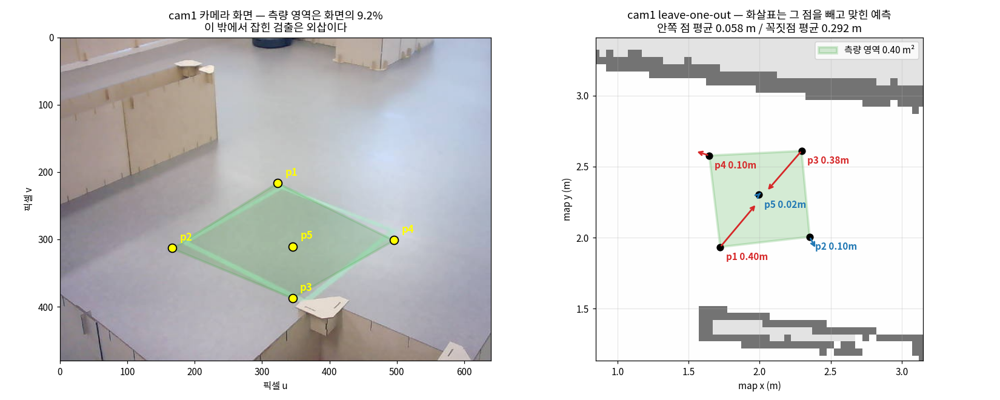
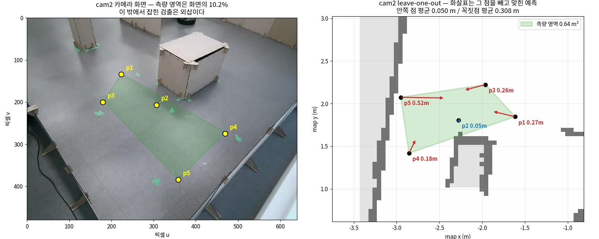

# 호모그래피 검증 (2026-08-07)

고정 웹캠이 잡은 쓰러진 사람의 화면 좌표를 map 좌표로 바꾸는 행렬이
실제로 쓸 만한지 확인한 기록이다. 재현 명령은 다음 한 줄이다.

```bash
python3 tools/verify_homography.py
```

## 요약

**측량 영역 안이면 5cm, 벗어나면 최대 52cm 틀어진다. 그런데 그 영역은
화면의 9~10%뿐이고, 벗어난 검출도 그대로 발행되고 있다.**

| 항목 | cam1 (개방구역) | cam2 (골목) |
|---|---|---|
| 재투영 잔차 평균 | 0.005 m | 0.015 m |
| **leave-one-out — 영역 안쪽** | **0.058 m** | **0.050 m** |
| **leave-one-out — 영역 경계 밖** | **0.292 m** (최대 0.398) | **0.308 m** (최대 0.516) |
| 측량 영역 넓이 | 0.40 m² | 0.64 m² |
| 측량 영역이 덮는 화면 비율 | 9.2% | 10.2% |
| 1픽셀 ≈ 맵에서 | 0.3~0.5 cm | 0.3~1.2 cm |




## 재투영 잔차만 보면 안 되는 이유

`tools/fit_homography.py` 가 내는 잔차는 5mm, 15mm 로 아주 좋아 보인다.
하지만 그 값은 **행렬을 맞출 때 쓴 바로 그 점들**의 오차다. 측량점이 5개이고
호모그래피의 자유도가 8이니 남는 여유가 2뿐이라, 잔차가 작은 것은 당연하고
새로운 검출도 정확하다는 근거가 되지 못한다.

그래서 leave-one-out 을 썼다. 점 하나를 빼고 나머지 4점으로 행렬을 맞춘 뒤
뺀 점을 얼마나 맞히는지 본다. 뺀 점은 측량에 쓰이지 않았으므로, 그 오차가
실제 검출에서 기대할 수 있는 정확도다. 결과는 재투영 잔차의 **10~30배**였다.

## 안과 밖이 다르다

leave-one-out 결과가 점마다 크게 갈렸는데, 규칙이 분명했다.

- **볼록껍질 안쪽 점** (cam1 p5, cam2 p2): 0.018 m, 0.050 m
- **꼭짓점** (빼고 나면 나머지 4점의 바깥이라 외삽이 된다): 0.10~0.52 m

즉 행렬 자체는 정확하다. 문제는 **측량한 사각형을 벗어나는 순간 급격히
나빠진다**는 것이다. 원근 변환이라 영역 밖에서는 오차가 선형이 아니라
가속해서 커진다.

## 측량 영역이 너무 좁다

cam1 은 0.40 m², cam2 는 0.64 m² 다. 사방 60~80cm 짜리 사각형이고,
카메라 화면으로 치면 9~10% 밖에 안 된다. 나머지 90% 에서 사람이 쓰러지면
좌표는 외삽이 된다.

실제로 오늘 `camera:=1` 로 검출을 돌렸을 때 나온 위치가 (2.50, 2.26) 이었고,
이는 측량 영역 경계에서 **0.171 m 밖**이었다. 로그에도 계속 이 경고가 찍혔다.

```
Detected location is outside surveyed area: (2.50, 2.26);
publishing extrapolated homography coordinates
```

## 외삽 좌표가 걸러지지 않고 나간다

`homography_cam1.yaml` 의 주석은 이렇게 적혀 있다.

```yaml
# 좌표 변환을 신뢰할 수 있는 범위. 이 밖의 검출은 외삽이라 버립니다.
survey_area:
```

하지만 코드는 버리지 않는다. `vision_detector.py` 의 `_target_location()` 은
영역 밖이면 경고를 찍고 `"homography_extrapolated"` 라는 표시를 붙여
**좌표를 그대로 돌려준다.** 그리고 그 표시는 `status` 토픽의 JSON 에만 담기고,
정작 로봇을 움직이는 `EmergencyEvent.location` 과 `fallen_location`
(`PointStamped`) 에는 들어가지 않는다. 저장소 안에서 `location_source` 를
구독하는 코드도 없다.

결과적으로 mission_manager 는 **최대 50cm 틀릴 수 있는 좌표를 정상 좌표와
구별 없이 받아** 로봇을 보낸다. 사람 한 명의 폭이 대략 0.5m 이므로, 이 오차는
"쓰러진 사람 옆"이 아니라 "다른 자리"를 가리킬 수 있는 크기다.

## 이 검증의 한계

측량점이 카메라당 5개뿐이고, 그중 볼록껍질 **안쪽 점은 1개**다
(cam1 은 p5, cam2 는 p2). 그래서 "영역 안에서 5cm" 라는 숫자는 각 카메라당
표본 하나에서 나온 값이고, 통계적 근거로는 약하다. 방향은 믿을 수 있지만
정확한 수치로 인용하기에는 점을 더 찍어야 한다.

## 다음에 할 일

1. **측량점을 늘린다.** 특히 영역 안쪽에. 지금은 안쪽 점이 하나뿐이라
   "영역 안이면 정확하다"를 제대로 못 보여준다. 8~10점을 권한다.
2. **측량 영역을 넓힌다.** 사람이 실제로 쓰러질 수 있는 범위를 덮어야 한다.
   지금은 화면의 10% 뿐이다.
3. **외삽 좌표를 어떻게 다룰지 정한다.** 셋 중 하나여야 한다.
   - 주석대로 버린다 (검출은 알리되 좌표는 안 보낸다)
   - `EmergencyEvent` 에 신뢰도 필드를 넣어 mission_manager 가 판단하게 한다
   - 외삽도 그대로 쓴다면, 주석을 사실에 맞게 고친다
